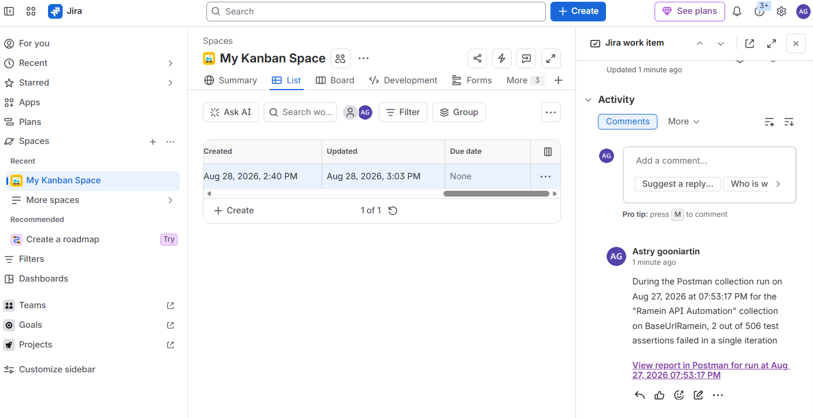

<div align="center">

# Ramein API Automation

### API Testing & CI/CD Quality Engineering Portfolio

**End-to-End API Automation Testing using Postman, Newman, and GitHub Actions**


</div>

---

# 📖 Overview

This repository contains an **API Automation Testing project for Ramein**, a digital event and ticketing platform.

The project demonstrates a practical **Software Quality Assurance (SQA) workflow**, from API test design and validation to command-line execution and CI/CD integration.

The project covers:

- Manual API testing
- Positive & negative testing
- API contract/reference validation
- Postman test scripting
- Environment & variable management
- End-to-end API flow validation
- Newman CLI execution
- GitHub Actions CI automation
- Defect identification and documentation

The focus is not only on testing individual endpoints, but also on validating **business flows and dependencies between APIs**.

---

# 🎯 Objectives

- Validate Ramein REST API functionality.
- Verify HTTP status codes and response bodies.
- Validate business rules and required fields.
- Test positive and negative scenarios.
- Validate authentication and token-based authorization.
- Validate dependencies between API requests.
- Automate repetitive API test execution.
- Execute the same collection through Newman.
- Integrate API automation into GitHub Actions.
- Document defects and known limitations professionally.

---

# 🛠️ Technology Stack

| Category | Tools |
|---|---|
| API Testing | Postman |
| API Automation | Postman Scripts / JavaScript |
| CLI Runner | Newman |
| CI/CD | GitHub Actions |
| API Style | REST API |
| Documentation | Markdown |
| Version Control | Git & GitHub |
| API Reference | API Contract |
| Jira | Defect tracking and issue management |

---

# 📂 Repository Structure

```text
QA_RAMEIN_API_AUTOMATION
│
├── .github
│   └── workflows
│       └── api-test.yml
│
├── Contract
│   └── API-CONTRACT-RAMEIN.md
│
├── Postman-Files
│   ├── Ramein API Automation.postman_collection.json
│   └── BaseUrlRamein.postman_environment.json
│
├── Report
│   ├── RAMEIN_APITest_Summary_BugReport.xlsx
│   └── Ramein_API_Test_Cases.xlsx
│
└── README.md
```

---

# 🧪 Test Coverage

The collection contains **102 API test cases** covering the main Ramein API modules.

### 🔐 Authentication

- User registration
- Duplicate registration
- Login
- Access token validation
- Refresh token
- Authentication negative cases

### 👤 User

- User information retrieval
- User data validation
- Authentication-dependent operations

### 🎫 Events

- Event creation
- Event retrieval
- Event validation
- Positive scenarios
- Negative scenarios
- Invalid request validation

### 🎟️ Ticket & Transaction

- Ticket type handling
- Ticket purchase
- Transaction flow
- Payment flow
- My Ticket retrieval
- QR Code retrieval
- QR Code scanning
- Attendance status validation

---

# 🔍 Testing Techniques

## Positive Testing

Valid requests are used to verify expected API behavior.

Examples:

- Successful login
- Successful event creation
- Successful ticket purchase
- Successful ticket retrieval
- Successful QR scan

## Negative Testing

Invalid or unexpected input is used to verify that the API rejects incorrect requests.

Examples:

- Invalid event ID
- Invalid request data
- Duplicate registration
- Invalid ticket/QR data
- Missing or incorrect parameters

## Response Validation

Assertions validate:

- HTTP status code
- `success` value
- Response message
- Response data type
- Required fields
- Generated IDs
- QR Code
- Attendance status
- Timestamp fields

---

# 🔗 End-to-End API Dependency

The collection contains chained API flows where values generated by one request are reused by subsequent requests.

```text
Login
   ↓
access_token
   ↓
Create Event
   ↓
event_id
   ↓
Create Transaction
   ↓
transaction_id
   ↓
Payment
   ↓
Get My Ticket
   ↓
qr_code
   ↓
Scan QR
   ↓
attendanceStatus = attended
```

This approach validates the API from a **real user journey perspective**, rather than testing endpoints only in isolation.

---

# 🌐 Environment & Variables

The Postman environment uses reusable variables such as:

```text
BaseUrl
access_token
refresh_token
token_user
event_id
ticket_type_id
transaction_id
order_id
qr_code
creator_id
```

Dynamic values are stored during execution and reused by subsequent requests.

Example:

```javascript
pm.environment.set(
    "token_user",
    jsonData.data.accessToken
);
```

> **Security:** Real credentials, passwords, API keys, and production secrets should never be committed to GitHub. Use GitHub Secrets or another secure secret-management solution for sensitive values.

---

# 💻 Running the Collection in Postman

The collection can be executed using the Postman Collection Runner.

Postman is useful during development because it allows inspection of:

- Request
- Response
- Environment variables
- Console logs
- Test results
- Assertion failures

---

# ⚡ Running with Newman

Install Newman:

```bash
npm install -g newman
```

Run the collection:

```bash
newman run "Postman-Files/Ramein API Automation.postman_collection.json"   -e "Postman-Files/BaseUrlRamein.postman_environment.json"
```

Newman allows the same Postman collection to run without the Postman GUI, making it suitable for CI/CD environments.

---

# 🔄 CI/CD with GitHub Actions

The project is integrated with **GitHub Actions** to execute API automation automatically.

```text
Git Push / Pull Request
        ↓
Checkout Repository
        ↓
Setup Node.js
        ↓
Install Newman
        ↓
Run Postman Collection
        ↓
Evaluate Assertions
        ↓
Pass / Fail
```

Example workflow:

```yaml
name: Ramein API Automation

on:
  push:
    branches:
      - main
  pull_request:
    branches:
      - main

jobs:
  api-test:
    runs-on: ubuntu-latest

    steps:
      - name: Checkout repository
        uses: actions/checkout@v4

      - name: Setup Node.js
        uses: actions/setup-node@v4
        with:
          node-version: 24

      - name: Install Newman
        run: npm install -g newman

      - name: Run API Automation
        run: |
          newman run "Postman-Files/Ramein API Automation.postman_collection.json"             -e "Postman-Files/BaseUrlRamein.postman_environment.json"             --reporters cli
```

---

# 📊 Test Execution

Newman provides CLI execution results including:

- Executed requests
- HTTP status codes
- Assertion results
- Failed test scripts
- Response timing
- Total duration
- Data received

This makes the automation suitable for **headless CI execution**.

---

## 📊 Test Execution Summary

| Metric | Result |
|---|---:|
| Total Test Cases | **102** |
| Confirmed Functional Bugs | **1** |
| Unexpected Validation Behaviors | **5** |
| Confirmed Jira Defects | **1** |

> Not every failed or unexpected response is automatically classified as a confirmed defect. Findings were reviewed and classified based on the observed API behavior and test intent.

## 🐞 Defect & Validation Findings

| TC | Finding | Classification |
|---|---|---|
| TC-API-038 | Invalid sale date order is accepted and event is created with `201 Created` | 🔴 Functional Bug |
| TC-API-047 | Invalid `eventId` causes an additional `items` validation error | 🟠 Unexpected Validation Behavior |
| TC-API-049 | Empty `items` also causes the valid `eventId` to be reported as invalid | 🟠 Unexpected Validation Behavior |
| TC-API-050 | Invalid `ticketTypeId` causes unrelated validation errors | 🟠 Unexpected Validation Behavior |
| TC-API-051 | `quantity = 0` causes unrelated validation errors | 🟠 Unexpected Validation Behavior |
| TC-API-052 | Negative `quantity` causes unrelated validation errors | 🟠 Unexpected Validation Behavior |


# 🐞 Known Issues

The project intentionally documents known issues instead of hiding failed tests.

## TC-API-038 — Invalid Event Request

**Expected**

```text
HTTP 400
success = false
```

**Actual**

```text
HTTP 201
success = true
```

### 🟠 Unexpected Validation Behavior

During negative testing of transaction requests, several scenarios consistently returned validation errors for both:

```text
eventId
items
```

even when the negative case targeted a different field.

These findings are documented separately from the confirmed functional bug so that unexpected behavior is not automatically over-classified as a defect.

## 🔗 Jira Defect Tracking

Confirmed defects are tracked in Jira.

### KAN-1

**Summary:**  
`Event API accepts invalid sale date range and creates event successfully`

**Related Test Case:**  
`TC-API-038`

**Issue Type:**  
`Bug`

**Priority:**  
`Medium`

**Status:**  
`To Do`

The Postman test execution result for the same failing scenario was connected to the existing Jira issue rather than creating a duplicate defect.

> Add Jira evidence screenshot here:
>
> 

### QA Observation

An invalid request is accepted by the API instead of being rejected.

This indicates a potential **backend validation/business-rule defect**.

---

## TC-API-055 — My Ticket Returns Empty Data in Newman

The test case verifies that a previously purchased and paid ticket can be retrieved.

### Expected

```json
{
  "success": true,
  "data": [
    {
      "qrCode": "..."
    }
  ]
}
```

### Actual in Newman

```json
{
  "success": true,
  "message": "My ticket list",
  "data": []
}
```

The same flow can return ticket data during interactive Postman execution.

### QA Observation

The endpoint returns HTTP `200`, but the expected ticket data is not available in the Newman execution context.

This issue prevents the QR Code from being extracted for the following dependent test.

---

## TC-API-067 — QR Scan Dependent Failure

TC-API-067 requires the QR Code produced by the previous ticket flow.

When TC-API-055 returns:

```text
data = []
```

the QR Code cannot be obtained.

As a result, TC-API-067 receives missing/invalid QR data and returns:

```text
HTTP 400
Validation error
```

### QA Observation

TC-API-067 is treated as a **cascading/dependent failure** rather than immediately classifying the QR scan endpoint itself as defective.

This demonstrates the importance of understanding **test-case dependencies when analyzing automation results**.

---

# 🧠 Postman vs Newman Investigation

One important finding from this project is:

> **A collection passing in Postman does not automatically guarantee identical behavior in Newman or CI.**

The investigation considered:

- Environment variable state
- Authentication/token state
- Test-data state
- Request execution order
- Data generated by previous requests
- Session/context differences
- Backend timing
- API test dependencies
- Differences between interactive and headless execution

This demonstrates why API automation should be validated in both:

1. Local interactive execution
2. Headless CLI/CI execution

---

# 📋 QA Deliverables

| Deliverable | Status |
|---|---|
| API Test Cases | ✅ |
| Positive Testing | ✅ |
| Negative Testing | ✅ |
| Postman Collection | ✅ |
| Environment Configuration | ✅ |
| API Contract Documentation | ✅ |
| Newman CLI Execution | ✅ |
| GitHub Actions Workflow | ✅ |
| Defect Identification | ✅ |
| Known Issue Documentation | ✅ |

---

# 🚀 Future Improvements

Planned improvements include:

- Independent automation test-data setup
- Dedicated automation test users
- Automated cleanup/teardown
- Better handling of dependent test cases
- Newman HTML/JSON reports
- GitHub Actions artifacts
- CI test summaries
- Secure GitHub Secrets
- Separate Smoke and Regression collections
- API schema validation
- Automated defect reporting integration

---

# 💡 What This Project Demonstrates

### API Testing

- REST API testing
- HTTP status validation
- Response body validation
- Positive & negative testing
- Business-rule validation

### Automation

- Postman scripting
- JavaScript assertions
- Dynamic environment variables
- Chained API requests
- End-to-end API flows
- Newman CLI execution

### CI/CD

- GitHub Actions workflow
- Automated API execution
- Headless testing
- Pipeline pass/fail validation

### QA Engineering

- Test case design
- Test dependency analysis
- Failure investigation
- Root-cause analysis
- Defect identification
- Known-issue documentation

---

# 👩‍💻 About Me

**Astry Gooniartin**

Software Quality Assurance Engineer

### Skills

- Manual Testing
- API Testing
- API Automation
- Postman
- Newman
- JavaScript
- Web Automation
- Mobile Automation
- Selenium
- Appium
- Robot Framework
- Git & GitHub
- CI/CD
- GitHub Actions

---

# 📬 Connect With Me

**GitHub**  
https://github.com/Astrygoo

**LinkedIn**  
https://www.linkedin.com/in/astry-gooniartin-0a9ba8149

---

<div align="center">

### ⭐ Thank you for visiting this repository!

This project is part of my journey in Software Quality Assurance, API Automation, and CI/CD.

</div>
